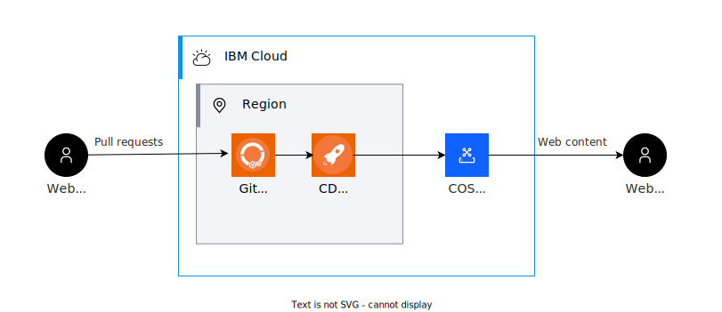

# terraform-ibm-static-website
# Static Website Sample
This sample deployable architecture creates a free, static website as a proof of concept. It uses the IBM Cloud Terraform provider to create the following:
- A Cloud Object Storage bucket configured for public web access
- A toolchain that provides a hosted GitLab repo to store a static website HTML
- A simple pipeline that copies that HTML to the Cloud Object Storage bucket when the main branch is updated

The result is a simple static website with its source stored in a GitLab repository that automatically updates when the repo is updated.


## Reference architectures



## Usage

```hcl
export ibmcloud_api_key=<ibm user api key>
export region=us-south
export resource_group=default
export cos_bucket_name=mybucketname
terraform plan
```

## Required IAM access policies
The following permissions are required to run this module:

- **Cloud Object Storage** service
    - The `Editor` platform role
    - The `Manager` service role
- **Toolchain** service
    - The `Administrator` platform role


<!-- BEGINNING OF PRE-COMMIT-TERRAFORM DOCS HOOK -->
## Requirements

| Name | Version |
|------|---------|
| <a name="requirement_terraform"></a> [terraform](#requirement\_terraform) | >= 1.4.6 |

<!-- END OF PRE-COMMIT-TERRAFORM DOCS HOOK -->


## Limitations
- This sample requires an Identity and Access Management (IAM) API key.
- The name of the GitLab repository ("app_repo_name") must be unique in the target account.
- This sample also requires a GitLab access token with API and write-repository scopes. You can generate one by logging in to your IBM GitLab account and generating a personal access token in your account settings.
- The name of the COS bucket ("cos_bucket_name") must be globally unique.
- This sample can be deployed only to regions where toolchains are supported.
- You can have only a single "lite" COS instance. If you want to deploy more instances, then switch to the "standard" plan.
- This sample requires the jq command line tool installed on your device when provisioned locally.

## Onboarding to a private catalog
- As part of the onboarding process, the **ibm_catalog.json** file will handle some of the work of filling out the details of the deployable architecture. This includes pre-filling the configuration metadata and Security and Compliance Center profiles. Regardless, it is up the end-user to define the remainder of the deployable architecture's metadata in the onboarding process which includes the name, tags, keywords, etc.

Complete the following steps to onboard the static website to a private catalog:
1. Go to **Manage** > **Catalogs** > **Private catalogs** in the IBM Cloud console.
1. Select the private catalog where you want to add your product, and click **Add**. If you do not have any private catalogs, click **Create** to add one.
1. Select **Deployable architecture** as the type of the product that you're adding.
1. Choose **Terraform** as your delivery method.
1. Select **Public repository** as the type of repository.
1. Enter the source URL. This source URL ends in `tar.gz` and must point to the release snapshot for the version that you're importing.
1. Enter the software version in the format of major version, minor version, and revision, for example, `1.0.0`. Typically, this version matches the version number of your release snapshot.
1. Select a category.
1. Click **Add product**.

Select the version that you added from the version list to continue configuring it. Validate the static website, then share it to your private catalog.

After the static website is shared to your private catalog, you can deploy it by using a project.
